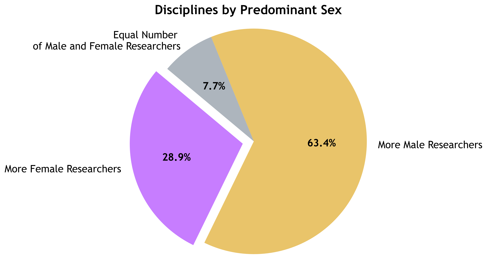
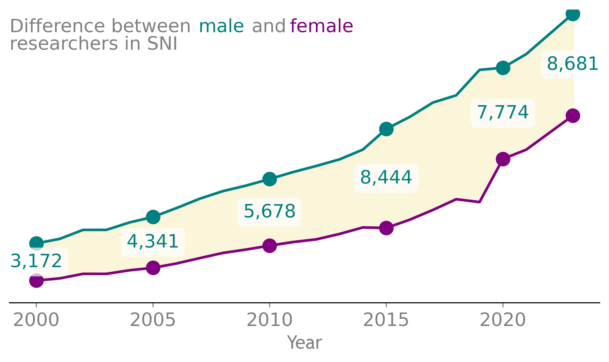
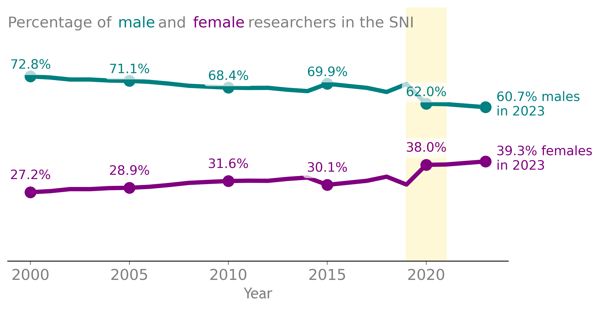
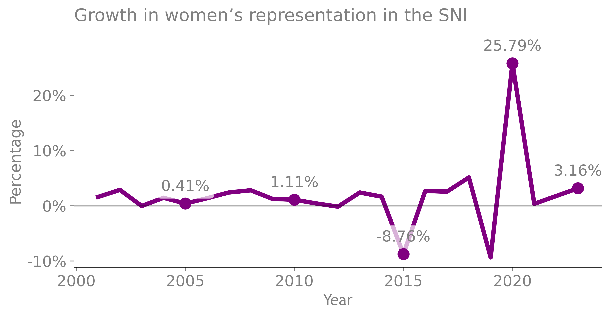

#### Author's note:

Hello Information is Beautiful!

I've decided to create a web page using VS Code and Quarto to give your team a quick link to a writing sample and some of my abilities. Some time ago, I was playing with open data from the Mexican National System of Researchers (SNI), trying to find something interesting to tell. Back then, I made the data cleaning and analysis on a Jupyter Notebook (Python-based). This is the perfect opportunity to resume the project by finishing it with a story and some data visualization. I hope you find my voice engaging.

Diana

---

::: {.story-section}

In Mexico, the National System of Researchers (SNI) has thousands of scientists as members across the country. It is known that women have been underrepresented in science for many years, especially in STEM fields, creating a gender gap in research that remains to this day.

But in 2020, something unexpected happened: female representation grew at its highest rate since the beginning of the system.

Could this be a sign that the gender gap in Mexican science can be closed?

:::

---

::: {.story-section}

## The gap

For decades, the pattern seemed difficult to change: women’s participation was increasing, but the difference between female and male researchers remained remarkably stable.

Then, in 2020, something shifted.

The number of women researchers in the SNI increased significantly, shortening the gap and bringing women’s representation to its lowest disparity level since 2000.

Looking at the data from a percentage growth perspective, a remarkable spike appears in the number of female researchers recognized by the SNI. Compared with the previous year’s values, the number of women holding an SNI distinction increased by 25.79%!

This is encouraging news. A single dataset cannot reveal all the reasons behind this change, but this progress coincides with years of efforts to support women in science, including institutional policies focused on inclusion, gender equity, maternity considerations, adjustments in evaluation criteria for researcher mothers, and greater gender balance in evaluation committees.

While this shift could be atributed to many factors, the data reveals positively that Mexican science can move toward a more balanced representation of women.

:::

---

::: {.story-section}

## About the data

Data source: National System of Researchers (SNI) 2023, Mexico.

Analysis and visualization: Python (Pandas, Matplotlib, Seaborn).

### Author's AI disclaimer:

I've used Grammarly AI and ChatGPT to check my spelling and grammar in order to avoid errors. I'm at a high C1 level in English according to my TOEFL certification, but I'm not a native speaker, as my primary language is Spanish. 

Thank you for reading. This was a quick sample made in about 6 hours (not counting the data analysis time). I truly enjoy science journalism, and I hope to have the opportunity to move forward in this job application.

Greetings!

:::

